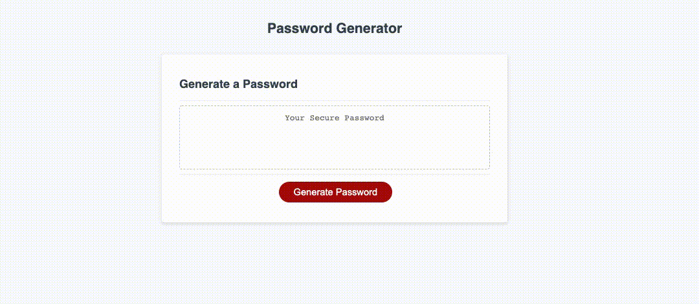

# JavaScript: Password Generator

# Website

**View** [Live Link](https://faithelizagreen.github.io/password_generator/)

This password generator is built using:

- Dynamic HTML & CSS
- JavaScript

# Task

Create a browser application that enables employees to generate random passwords based on criteria that they've selected. 

The password must:

- Be between 8 and 128 characters long
- Include atleast one of the following: lowercase, uppercase, numbers, or special characters.

# Project Visual
